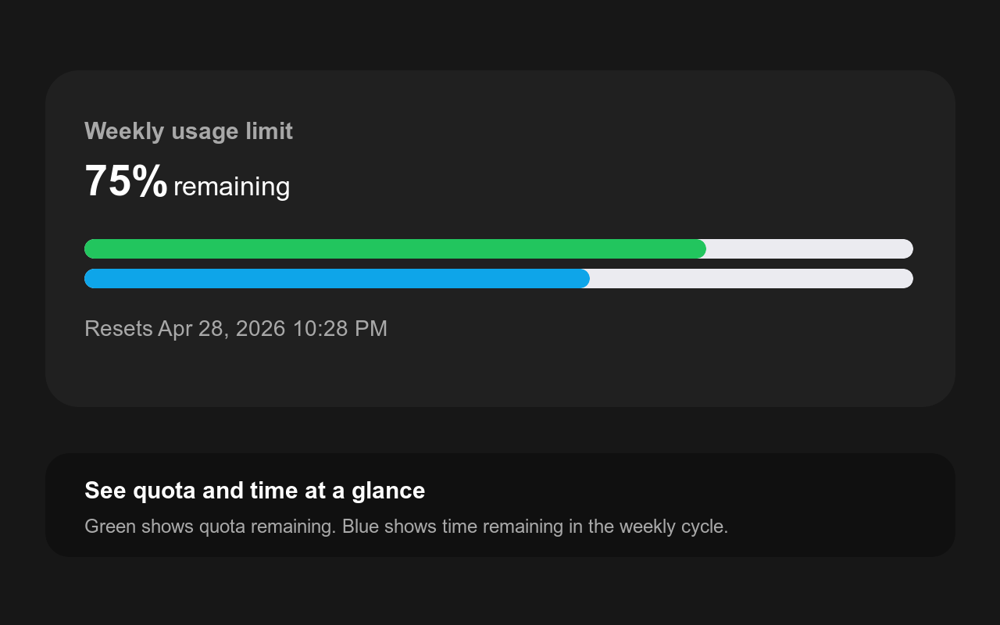

# Codex Usage Time Remaining

Tiny Chrome extension for the ChatGPT Codex usage page.

It keeps the original green weekly quota bar and adds a second blue bar below it. The blue bar shows how much time is left in the current 7-day reset cycle, based on the reset time displayed by ChatGPT.

## Install

1. Download the latest ZIP from [GitHub Releases](https://github.com/barthezslavik/codex-usage-time-remaining/releases).
2. Unzip it.
3. Open `chrome://extensions`.
4. Enable `Developer mode`.
5. Click `Load unpacked`.
6. Select the unzipped folder.
7. Open the [ChatGPT Codex usage page](https://chatgpt.com/codex/settings/usage).

## Privacy

The extension is injected only on `chatgpt.com/codex/*` pages and renders the bar only on the [ChatGPT Codex usage page](https://chatgpt.com/codex/settings/usage) or its redirected analytics URL.

It reads the visible reset date from the usage card and renders a second progress strip. It does not collect, store, transmit, sell, or share personal data.

See [PRIVACY.md](PRIVACY.md).

## Support

If this saves you time, you can [support the project on Ko-fi](https://ko-fi.com/barthezslavik).

Source and issues are on [GitHub](https://github.com/barthezslavik/codex-usage-time-remaining).

## Disclaimer

This is an unofficial extension and is not affiliated with OpenAI, ChatGPT, Codex, Google, Chrome, or Ko-fi.
