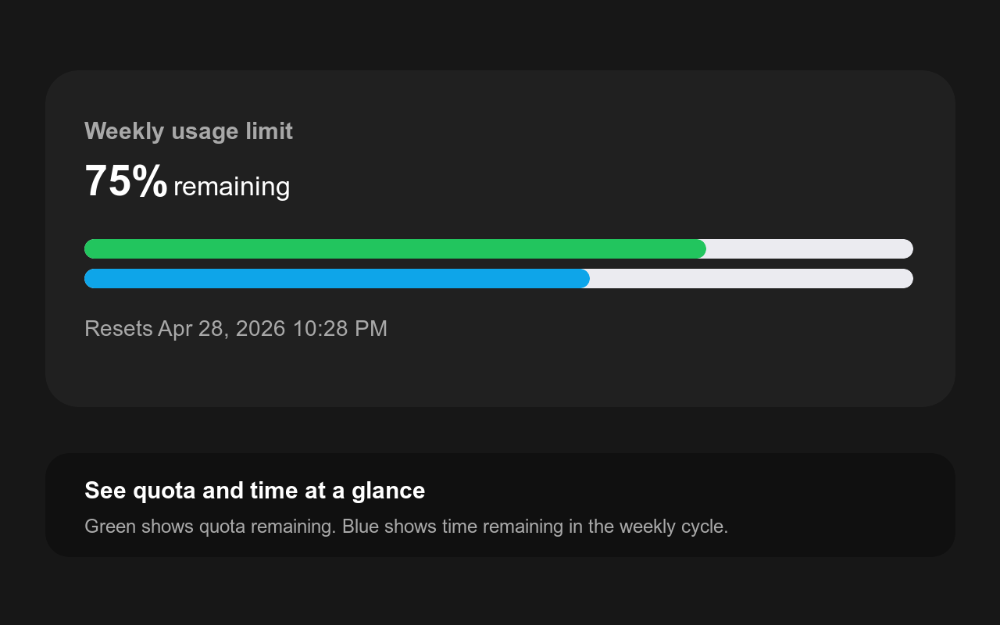

# Codex Usage Time Remaining

Tiny Chrome extension for supported AI usage pages.

It keeps the original usage bar and adds a second time bar below it. The toolbar icon also shows a timer badge based on the latest reset time seen on the usage page.

## Install

1. Download the latest ZIP from [GitHub Releases](https://github.com/barthezslavik/codex-usage-time-remaining/releases).
2. Unzip it.
3. Open `chrome://extensions`.
4. Enable `Developer mode`.
5. Click `Load unpacked`.
6. Select the unzipped folder.
7. Open the [ChatGPT Codex usage page](https://chatgpt.com/codex/settings/usage) or Claude usage settings.

## Privacy

The extension is injected only on `chatgpt.com/codex/*` and `claude.ai/*` pages, and renders only on supported usage settings views.

It reads the visible reset date from the usage card, renders a second progress strip, and stores the latest reset snapshot locally for the toolbar icon. It does not transmit, sell, or share personal data.

See [PRIVACY.md](PRIVACY.md).

## Support

If this saves you time, you can [support the project on Ko-fi](https://ko-fi.com/barthezslavik).

Source and issues are on [GitHub](https://github.com/barthezslavik/codex-usage-time-remaining).

## Disclaimer

This is an unofficial extension and is not affiliated with OpenAI, ChatGPT, Codex, Anthropic, Claude, Google, Chrome, or Ko-fi.
